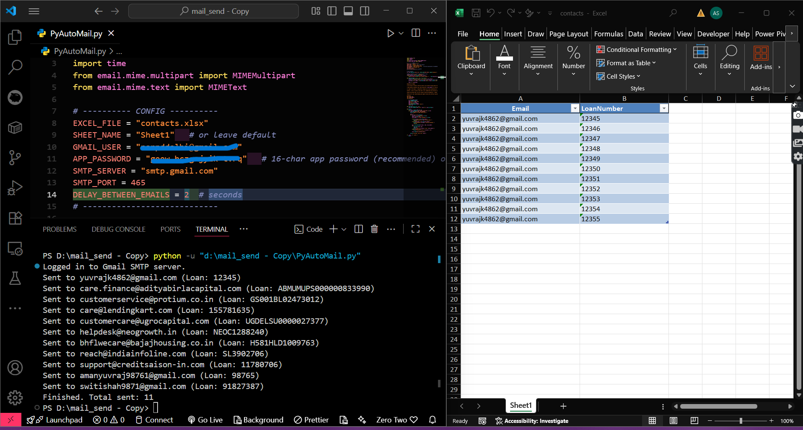

# 📧 PYAUTOMail  

**PYAUTO Mail** is a Python-based automation tool that sends emails to multiple recipients whose details are stored in an Excel file. It’s simple, efficient, and desiged for quick email campaigns or bulk notifications.  

---

## ✨ Features  
- 📊 Reads recipient details (Name, Email) directly from an Excel file  
- 📧 Automates email sending via Python (`smtplib`)  
- 🔄 Supports multiple recipients in one go  
- ⚡ Easy to configure, lightweight, and reusable  
- 📝 Clear logging of sent emails (optional to implement)  

---

## 🛠️ Requirements  
- **Python 3.x**  
- Required libraries:  
  pip install pandas openpyxl

## ScreenShots

 
   

 

